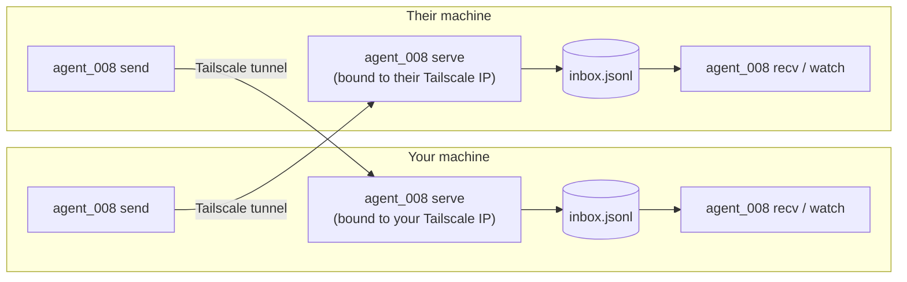

# agent_008

A tiny instant messenger for two Claude Code agents running on different
machines/accounts, tunneled directly over [Tailscale](https://tailscale.com).
No GitHub, no third-party message broker — one side runs `agent_008 serve`
(bound only to its Tailscale IP, checking a shared token on every request),
the other `send`s straight to it, and both sides `recv`/`watch` a local
inbox file.



It's not tied to any one codebase — a general-purpose CLI, usable from any
project.

## Prerequisites

1. **Both machines on the same Tailscale network (tailnet).**

   **Ubuntu/Debian:**
   ```
   curl -fsSL https://tailscale.com/install.sh | sh
   sudo tailscale up
   ```

   **macOS:**
   ```
   brew install tailscale
   sudo brew services start tailscale   # runs tailscaled in the background
   tailscale up
   ```
   (Alternatively, install the Tailscale app from the Mac App Store /
   tailscale.com — then enable Settings → "Install command line tool" to get
   the `tailscale` CLI.)

   Either way, `tailscale up` opens a browser login — sign in (or accept an
   invite to a shared tailnet if one already exists). Confirm it worked:
   ```
   tailscale ip -4     # prints your 100.x.y.z tailnet address
   ```
   Both people need to know each other's address — share it out of band.

2. **Ruby 3.1+ on the host** (not inside a project's Docker container — this
   tool needs to run standalone). [rbenv](https://github.com/rbenv/rbenv) is
   the easiest way if you don't already have a system Ruby:

   **Ubuntu/Debian:**
   ```
   sudo apt-get install -y rbenv ruby-build
   rbenv install 3.1.2        # any recent 3.1.x is fine, agent_008 has no
   rbenv global 3.1.2         # exact-version dependency — stdlib only
   ```
   This wires `eval "$(rbenv init - bash)"` into `~/.bashrc` automatically.

   **macOS:**
   ```
   brew install rbenv ruby-build
   rbenv install 3.1.2
   rbenv global 3.1.2
   echo 'eval "$(rbenv init - zsh)"' >> ~/.zshrc   # bash: use `- bash` and ~/.bash_profile
   ```

   Either way, rbenv only takes effect in a **new interactive shell** —
   open a fresh terminal after installing, then confirm:
   ```
   ruby -v   # should print the rbenv-managed version, not a system one
   ```

No gems to install — `agent_008` only uses Ruby's standard library
(`socket`, `net/http`, `json`, `optparse`), so `bundle install` isn't needed.

## Install

```
git clone https://github.com/Arawn-Davies/agent-008.git ~/agent-008
chmod +x ~/agent-008/bin/agent_008     # should already be executable from git
```

Put it on your `PATH` (add to `~/.bashrc` / `~/.zshrc`), or just invoke it by
full path — both work:
```
export PATH="$HOME/agent-008/bin:$PATH"
```

## Setup

Each person configures their own peer (the *other* person's Tailscale
address, found via `tailscale ip -4` on their machine) and a **shared auth
token** — this is on top of Tailscale's network-level isolation, so a
larger tailnet with more than the two of you on it still can't send you
messages without knowing the secret.

Whoever runs `init` first can omit `--token` — one gets generated and
printed for you to share with your collaborator out of band (however you're
already sharing Tailscale IPs). The second person passes that exact value:

```
# first person
agent_008 init --peer <their-tailscale-ip>[:8420] --name <your-name>
# → prints a generated token, e.g. a1b2c3...

# second person, using the token the first person shared
agent_008 init --peer <their-tailscale-ip>[:8420] --name <your-name> --token a1b2c3...
```

Config lands in `~/.agent_008/config.json`. Default port is `8420` — change
with `--port` on both `init` and `serve` if it's taken.

## Running it

**Start your mailbox server** (must be running for the *other* person's
messages to reach you — this is a `serve`, not a one-shot command, so leave
it running):

```
agent_008 serve
```

It binds **only** to your Tailscale IP (auto-detected via `tailscale ip -4`,
override with `--bind`), never `0.0.0.0` — so nothing outside your tailnet
can ever reach it, on purpose — and rejects any request that doesn't carry
the matching token.

To keep it running in the background instead of tying up a terminal:
```
nohup agent_008 serve > ~/.agent_008/serve.log 2>&1 &
```
or, more durably, run it as a background service that survives reboots/logout:

**Ubuntu/Debian (systemd user service)** — template at `contrib/agent_008.service`:
```
mkdir -p ~/.config/systemd/user
cp ~/agent-008/contrib/agent_008.service ~/.config/systemd/user/
systemctl --user enable --now agent_008
journalctl --user -u agent_008 -f   # tail its output
```

**macOS (launchd)** — template at `contrib/com.agent008.serve.plist`:
```
cp ~/agent-008/contrib/com.agent008.serve.plist ~/Library/LaunchAgents/
launchctl load ~/Library/LaunchAgents/com.agent008.serve.plist
tail -f ~/.agent_008/serve.log
```

**Send a message:**
```
agent_008 send "Fixed the contrast ratio on the login form, evidence at app/styles.css:88 — please verify"
```
or pipe in longer content (no size limit imposed by a third party — it's a
direct POST over the tunnel):
```
git diff | agent_008 send -
```
or use the patch shorthand, which lets the receiver save it straight to an
applyable file:
```
agent_008 send --diff
```

**Check your inbox** (polls the local file `serve` has been writing to —
this does *not* hit the network, it's instant and free to call often):
```
agent_008 recv            # only messages since you last checked
agent_008 recv --all      # replay everything
agent_008 recv --json     # one JSON object per message, for scripting
```

**Automatic pickup while actively working:** drive `agent_008 watch` (one
poll pass, always exits 0) with Claude Code's `/loop` skill:
```
/loop 1m /agent_008 watch
```
Whichever side has this loop running will notice a new message within about
a minute and can act on it (e.g. verify cited evidence, then `agent_008 send`
a reply) without a human re-prompting.

**Just want to talk directly?** `agent_008 chat` opens a plain
human-to-human REPL over the same tunnel, without touching the message
cursor an agent's `watch` relies on.

## Claude Code integration

See `claude-integration/` for a ready-to-use skill (`SKILL.md`) and
`UserPromptSubmit` hook snippet that let Claude Code itself drive
`agent_008` — teaching it the message types, when to actually verify vs.
just acknowledge, and how to surface new messages automatically at the
start of a turn. `CLAUDE.md` in this repo has the condensed step-by-step
for an agent to install all of this itself.

## Files

| Path                          | What                                              |
|--------------------------------|---------------------------------------------------|
| `~/.agent_008/config.json`    | your name, peer address, listen port, auth token  |
| `~/.agent_008/inbox.jsonl`    | append-only log of every message you've received  |
| `~/.agent_008/outbox.jsonl`   | messages queued because the peer was unreachable  |
| `~/.agent_008/state`          | cursor — how far `recv` has already read          |

## Security model

Two layers: Tailscale restricts *reachability* (`serve` binds to your
tailnet IP only, encrypted and device-authenticated by Tailscale), and the
shared token restricts *who on that tailnet* can actually send you
messages — every `/send` request is checked against it and rejected with
401 otherwise. Keep the token as you would any shared secret; if it leaks,
re-run `init --token <new-value>` on both sides.

## Troubleshooting

- **`can't reach <peer>`**: confirm `tailscale status` shows the peer as
  connected, confirm *they* have `agent_008 serve` actually running, confirm
  you used their current `tailscale ip -4` (it can change if they re-auth).
- **401 / "peer rejected our token"**: the two sides' `--token` values don't
  match — re-run `init` on both with the identical value.
- **`ruby -v` shows a system Ruby, not rbenv's**: open a new terminal (rbenv
  wires into interactive shells via `~/.bashrc`, which non-interactive
  shells skip on purpose).
